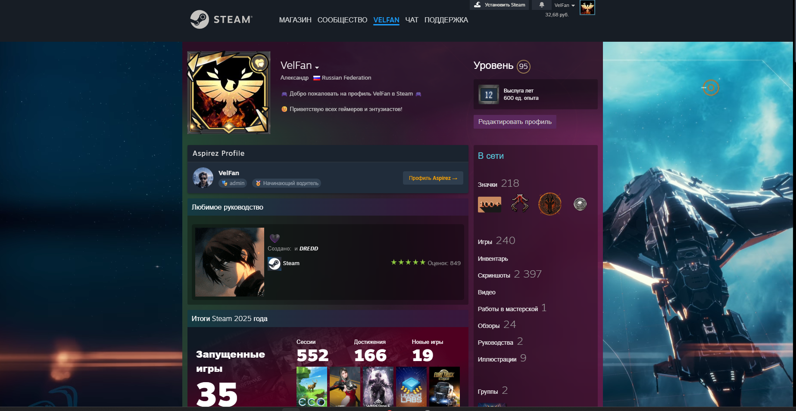

# Aspirez Profile Card on Steam

[](https://raw.githubusercontent.com/AlexVin-Dev/Aspirez-Profile-Card-on-Steam/main/aspirez-steam-card.user.js)
[](https://github.com/AlexVin-Dev/Aspirez-Profile-Card-on-Steam)
[](LICENSE)

> **Карточка профиля Aspirez в Steam**: показывает ник, ранг и роль пользователя из базы Aspirez прямо на его странице в Steam. Стилизована под стандартные блоки Steam.

 *(Здесь будет скриншот)*

---

## ✨ Возможности

- **Автоматическое определение** SteamID через `/profiles/` или `/id/`
- **Запрос к API** `https://aspirez.ru/api/get_aspirez_user.php`
- **Показывает**: ник, аватар, роль, ранг / звание, ссылку на профиль в Aspirez
- **Стилизация** в точности как у блоков Steam ("Любимое руководство")
- **Авто-обновление** через GitHub (при каждом запуске проверяет новую версию)

---

## 🛠️ Установка

### 1. Установите Tampermonkey
- **Chrome**: [ссылка на Web Store](https://chrome.google.com/webstore/detail/tampermonkey/dhdgffkkebhmkfjojejmpbldmpobfkfo)
- **Firefox**: [ссылка на Add-ons](https://addons.mozilla.org/firefox/addon/tampermonkey/)
- **Другие браузеры**: найдите расширение в официальном магазине.

### 2. Установите сам скрипт
- **Прямая установка**: [Нажмите сюда](https://raw.githubusercontent.com/AlexVin-Dev/Aspirez-Profile-Card-on-Steam/main/aspirez-steam-card.user.js), и Tampermonkey сам предложит установить скрипт.
- **Ручная установка**: создайте новый скрипт в Tampermonkey, скопируйте код из `aspirez-steam-card.user.js` и сохраните (Ctrl+S).

> **Важно**: API на `aspirez.ru` должен быть доступен и возвращать корректный JSON! Пример ответа:
> ```json
> {
>   "found": true,
>   "steamid": "76561198000000000",
>   "username": "VelFan",
>   "role": "Игрок",
>   "rank": "Золото",
>   "currentrank": "Мастер",
>   "profile_url": "https://aspirez.ru/favo/avgl/profile?id=..."
> }
> ```

---

## 📂 Структура репозитория

```
Aspirez-Profile-Card-on-Steam/
├── README.md                     # Этот файл
├── aspirez-steam-card.user.js    # Исходный код скрипта
└── screenshot.png                # Демонстрационный скриншот (опционально)
```

---

## 🔧 Как это работает?

1. Вы заходите на любой профиль Steam (`/profiles/` или `/id/`).
2. Скрипт определяет **SteamID64**.
3. Отправляет запрос на `https://aspirez.ru/api/get_aspirez_user.php?steamid=...`.
4. Если пользователь найден — в блок `.profile_customization_area` вставляется карточка с его данными (первым элементом).
5. Если не найден — показывается карточка с предложением привязать профиль.

---

## ❓ Часто задаваемые вопросы (FAQ)

**Вопрос**: Карточка не появляется. Что делать?
**Ответ**:
1. Убедитесь, что API на `https://aspirez.ru/api/get_aspirez_user.php` работает.
2. Проверьте, что блок `.profile_customization_area` существует на странице (в правой колонке профиля).
3. Посмотрите консоль браузера (F12) на наличие ошибок CORS или 404.

**Вопрос**: Как обновить скрипт?
**Ответ**: Автоматически — мы указали `@updateURL`. Либо вручную: скачайте новую версию из репозитория и замените код.

**Вопрос**: Почему используется именно `profile_customization_area`?
**Ответ**: Именно в этом блоке Steam показывает все свои виджеты (достижения, руководства, «о себе»). Наша карточка встанет в самый верх, как ещё один стандартный блок.

---

## 🤝 Вклад в проект

Мы рады любым идеям и улучшениям!
- **Сообщить об ошибке**: [создайте Issue](https://github.com/AlexVin-Dev/Aspirez-Profile-Card-on-Steam/issues)
- **Предложить изменение**: сделайте форк репозитория и отправьте Pull Request.

---

## 📜 Лицензия

Проект распространяется под лицензией **MIT**. Подробнее в файле `LICENSE`.

---

**Сделано с ❤️ для удобства пользователей Aspirez**

